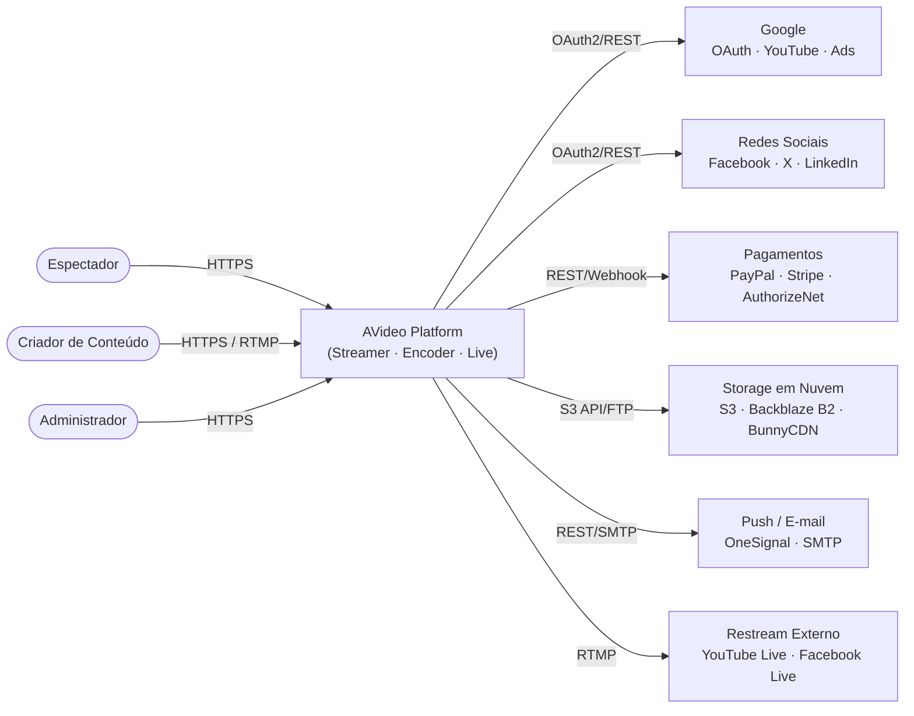
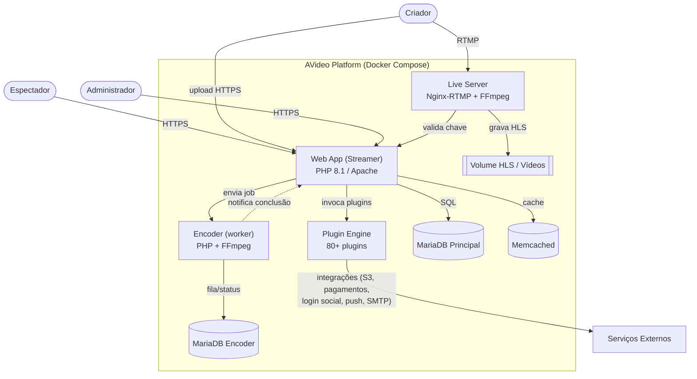
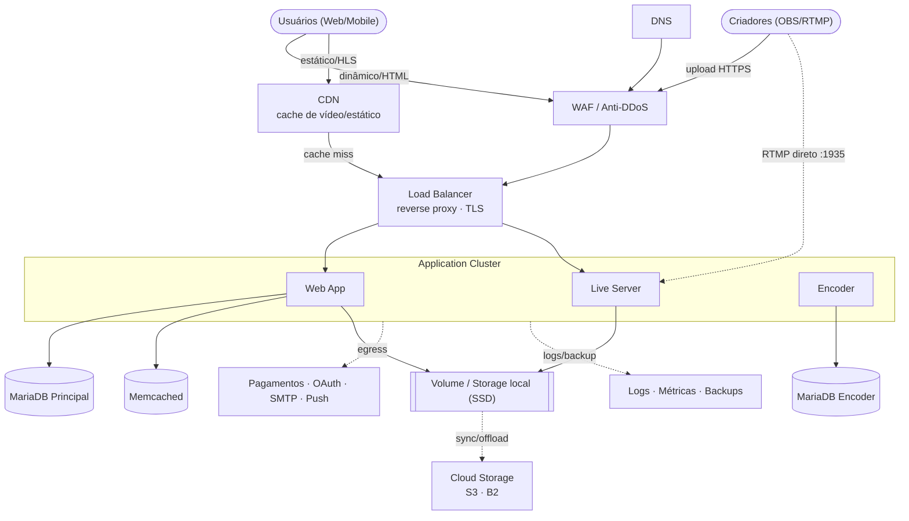

<p align="center">
  
</p>

<p align="center">
  <a href="https://github.com/WWBN/AVideo/actions/workflows/tests.yml">
    
  </a>
  <a href="https://github.com/WWBN/AVideo/stargazers">
    
  </a>
  <a href="https://github.com/WWBN/AVideo/network/members">
    
  </a>
  <a href="https://github.com/WWBN/AVideo/commits/master">
    
  </a>
  <a href="https://github.com/WWBN/AVideo">
    
  </a>
</p>

# AVideo Platform

> Este repositório é um **fork** do projeto original [WWBN/AVideo](https://github.com/WWBN/AVideo).

O **AVideo** é uma plataforma completa de streaming de vídeo, construída em **PHP 8.1** sobre **Apache**, pensada para criadores de conteúdo, empresas e desenvolvedores que precisam hospedar, gerenciar e monetizar vídeo sob demanda e transmissões ao vivo com infraestrutura própria. A plataforma é dividida em três componentes principais que operam de forma integrada — o **Streamer** (aplicação web que serve o catálogo, o player e a administração), o **Encoder** (worker de transcodificação baseado em FFmpeg que converte uploads para formatos compatíveis com a web) e o **Live Server** (servidor Nginx com módulo RTMP que recebe transmissões ao vivo e gera HLS em tempo real) — e conta com um motor de mais de 80 plugins que adicionam recursos como streaming HLS criptografado, chat ao vivo, monetização por assinatura e *pay-per-view*, integração com múltiplos provedores de armazenamento em nuvem, anúncios em vídeo e login social.

> ⚠️ **Uso ético**: este software deve ser usado exclusivamente para fins lícitos. A criação de conteúdo sexualmente explícito, pornográfico ou de temática adulta usando esta plataforma é estritamente proibida pelos termos do projeto original.

## Índice

- [Sobre o projeto](#sobre-o-projeto)
- [Arquitetura](#arquitetura)
  - [Diagrama de contexto (C1)](#diagrama-de-contexto-c1)
  - [Diagrama de containers (C2)](#diagrama-de-containers-c2)
  - [Diagrama de infraestrutura](#diagrama-de-infraestrutura)
- [Tecnologias utilizadas](#tecnologias-utilizadas)
- [Como executar com Docker](#como-executar-com-docker)
- [Requisitos para instalação manual](#requisitos-para-instalação-manual)
- [Suporte e documentação](#suporte-e-documentação)
- [Licença](#licença)

## Sobre o projeto

Principais características da plataforma:

- **Segurança de conteúdo**: streaming HLS criptografado, tanto para vídeo sob demanda quanto para transmissões ao vivo, com controle de chaves de acesso.
- **Live streaming com gravação**: transmissões ao vivo com chat integrado e gravação automática para acesso posterior.
- **Restream / multi-broadcast**: retransmissão simultânea da live para múltiplas plataformas externas (YouTube Live, Facebook Live, etc.).
- **Canais e playlists de usuários**: criadores podem organizar seu próprio canal, playlists e categorias temáticas.
- **Monetização**: assinaturas recorrentes, *pay-per-view*, anúncios em vídeo (VAST/VMAP) e integração com múltiplos gateways de pagamento.
- **Armazenamento escalável**: suporte nativo a S3, Backblaze B2, BunnyCDN e FTP para entrega de vídeo em alta escala.
- **API e integrações**: API REST documentada (Swagger) para integração com aplicações de terceiros.
- **Download e visualização offline**: opção de download protegido de vídeos para uso offline.

## Arquitetura

Os diagramas abaixo seguem o modelo **C4** (Contexto → Containers) e foram gerados a partir da análise do código-fonte do projeto (`docker-compose.yml`, `composer.json`, `Dockerfile`, `Dockerfile.live` e a estrutura de `plugin/`/`objects/`).

### Diagrama de contexto (C1)

Mostra como os três perfis de usuário interagem com o AVideo e quais serviços externos a plataforma consome.



### Diagrama de containers (C2)

Detalha os serviços que sobem via `docker-compose.yml` e como eles se relacionam dentro do sistema.



### Diagrama de infraestrutura

Topologia de implantação sugerida — o `docker-compose.yml` atual cobre o cluster de aplicação e a camada de dados num único host; a camada de borda (CDN, WAF, load balancer) é recomendada para produção em escala.



## Tecnologias utilizadas

| Categoria | Tecnologia | Finalidade |
|---|---|---|
| **Linguagem / Runtime** | PHP 8.1 | Linguagem principal da aplicação |
| **Servidor Web** | Apache 2.x (mod_rewrite) | Servidor HTTP/HTTPS do Streamer |
| **Live Streaming** | Nginx + nginx-rtmp-module + FFmpeg | Ingestão RTMP e geração de HLS ao vivo |
| **Transcodificação** | FFmpeg | Conversão de vídeos para formatos web (HLS/MP4) |
| **Banco de Dados** | MariaDB | Persistência de dados da aplicação e da fila do encoder |
| **Cache** | Memcached | Cache de sessões e objetos |
| **Frontend / Player** | Video.js + hls.js | Player de vídeo com suporte a HLS, VR, Chromecast e AirPlay |
| **Frontend / UI** | Bootstrap 5, jQuery, jQuery UI | Interface e componentes visuais |
| **Frontend / Editor** | TinyMCE, CodeMirror | Edição de texto rico e de código |
| **Gráficos** | Chart.js | Dashboards e relatórios administrativos |
| **Comunicação em tempo real** | Socket.IO, ReactPHP (amp, react/socket) | Chat ao vivo e eventos assíncronos |
| **Autenticação social** | HybridAuth, Google API Client | Login via Google, Facebook, LinkedIn, Apple, entre outros |
| **Pagamentos** | PayPal, Stripe, AuthorizeNet SDKs | Processamento de assinaturas, PPV e doações |
| **Armazenamento em nuvem** | AWS SDK PHP, Backblaze B2 SDK, BunnyCDN Storage | Upload e entrega de mídia escalável |
| **Notificações** | OneSignal PHP API, PHPMailer | Push notifications e e-mail transacional |
| **Segurança** | HTMLPurifier, phpseclib, OTPHP | Sanitização de HTML, criptografia e autenticação de dois fatores |
| **Logs** | Monolog | Registro estruturado de eventos da aplicação |
| **Documentação de API** | Swagger PHP (zircote/swagger-php) | Especificação OpenAPI da API REST |
| **Infraestrutura** | Docker, Docker Compose | Orquestração dos serviços (app, live, bancos, cache) |
| **Administração de banco** | phpMyAdmin | Interface web opcional para gestão do MariaDB |
| **CI/CD** | GitHub Actions | Build e publicação automatizada das imagens Docker |

## Como executar com Docker

### Pré-requisitos

- [Docker](https://docs.docker.com/get-docker/) e [Docker Compose](https://docs.docker.com/compose/install/) instalados
- Portas `80`, `443`, `1935`, `2053`, `3000`, `8080` e `8443` livres no host (ajustáveis via variáveis de ambiente)

### Passo a passo

1. **Clone o repositório**

   ```bash
   git clone https://github.com/WWBN/AVideo.git
   cd AVideo
   ```

2. **Copie o arquivo de variáveis de ambiente**

   ```bash
   cp env.example .env
   ```

3. **Ajuste as variáveis no `.env`** — no mínimo, defina:

   | Variável | Descrição |
   |---|---|
   | `SERVER_NAME` | Domínio/host pelo qual a plataforma será acessada |
   | `SYSTEM_ADMIN_PASSWORD` | Senha do usuário administrador (se vazia, uma senha é gerada automaticamente e salva em `videos/.initial_admin_password`) |
   | `DB_MYSQL_PASSWORD` | Senha do banco de dados |
   | `WEBSITE_TITLE` | Nome exibido no site |
   | `CONTACT_EMAIL` | E-mail de contato/administração |

4. **Suba os containers**

   ```bash
   docker compose up -d --build
   ```

   Isso inicia os serviços definidos em `docker-compose.yml`:
   - `avideo` — aplicação principal (Streamer)
   - `live` — servidor de transmissão ao vivo (RTMP/HLS)
   - `database` — MariaDB da aplicação
   - `database_encoder` — MariaDB da fila de encoding
   - `memcached` — cache de sessão/objetos

5. **(Opcional) Suba o phpMyAdmin**

   ```bash
   docker compose -f docker-compose.yml -f docker-compose-phpmyadmin.yml up -d
   ```

6. **Acesse a plataforma**

   - Aplicação: `http://localhost` (ou `https://localhost` se TLS estiver habilitado)
   - Ingestão de live via RTMP: `rtmp://localhost:1935`
   - phpMyAdmin (se habilitado): `http://localhost:8081`
   - Login inicial: usuário `admin` e a senha definida em `SYSTEM_ADMIN_PASSWORD`

7. **Acompanhar logs / parar os containers**

   ```bash
   docker compose logs -f avideo
   docker compose down
   ```

> 💡 O `docker-compose.yml` já define `healthcheck` para os serviços `avideo`, `live`, `database` e `database_encoder`, além de limites de CPU/memória configuráveis via `CPUS_LIMIT` e `MEMORY_LIMIT` no `.env`.

## Requisitos para instalação manual

Para instalação diretamente em um servidor Linux (sem Docker), o AVideo requer:

- **PHP** 8.0 ou superior
- **MySQL/MariaDB** 5.0 ou superior
- **Apache** 2.x com módulo `mod_rewrite` habilitado
- Ubuntu **sem** painéis de controle (cPanel, Plesk, Webmin, VestaCP), pois eles restringem a instalação de bibliotecas e a compilação de componentes essenciais como o Nginx com módulo RTMP

Guias detalhados por versão do Ubuntu estão disponíveis na [wiki oficial do projeto](https://github.com/WWBN/AVideo/wiki).

## Suporte e documentação

- Manual do administrador: [wiki do AVideo](https://github.com/WWBN/AVideo/wiki/Admin-manual)
- Guia de erros e troubleshooting: [wiki do AVideo](https://github.com/WWBN/AVideo/wiki/How-to-find-errors-on-AVideo-Platform)
- Site oficial: [streamphp.com](https://streamphp.com/)

## Licença

Distribuído sob a licença JSON (baseada na licença MIT, com a cláusula adicional de que o software deve ser usado "para o Bem, não para o Mal"). Veja o arquivo [`LICENSE`](./LICENSE) para o texto completo.
